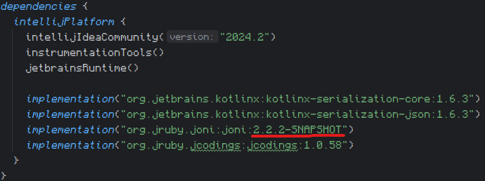
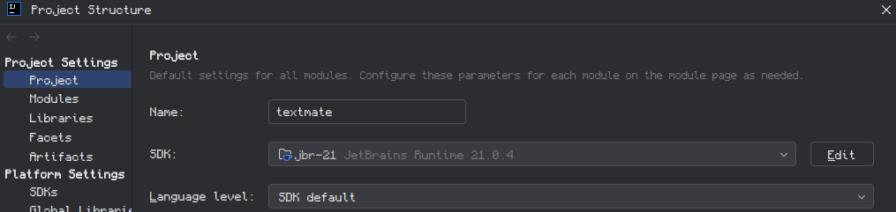
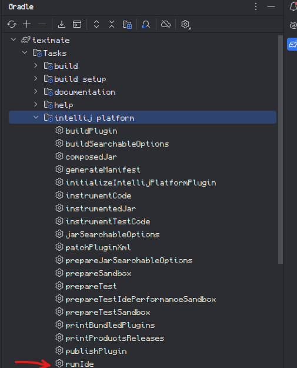
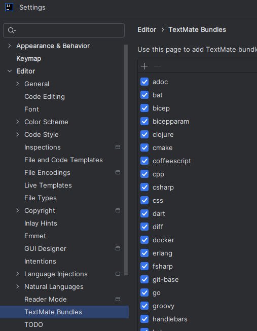

# TextMate Bundle IntelliJ IDEA plug-in mod

The TextMate Bundle native plug-in with custom configuration to provide the possibility to build and run it as a separate plug-in.

## How to run

To use the custom Joni library, put the built binaries under **libscustom** directory. The version is controlled in **build.gradle.kts**

File -> Project Structure -> Select Project SDK as Java 21 (better to download and setup the JetBrains Runtime here: https://github.com/JetBrains/JetBrainsRuntime/releases)

To run the project, in the Gradle plugin select runIde task

## Hot to test bundles

To test the HLASM TextMate bundles, you need to run the IDE with the plugin. After that, go to **File -> Settings -> Editor -> TextMate Bundles**

Click "+" button to add a TextMate Bundle. Select either **testData/bundles/hlasm_old** or **testData/bundles/hlasm_new** folder. In the _old folder, there is a version of the HLASM TextMate Bundle that works fine in IntelliJ and VS Code, but it has some grammar limitations. In the _new folder, there is a new version of the bundle, that works fine in VS Code but is not recognized correctly in IntelliJ.

To test the functionality of a bundle, after it is installed, open in editor **testData/factorial.hlasm**
